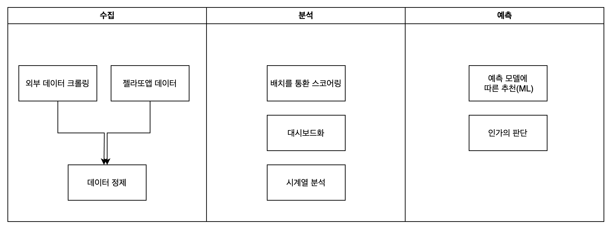
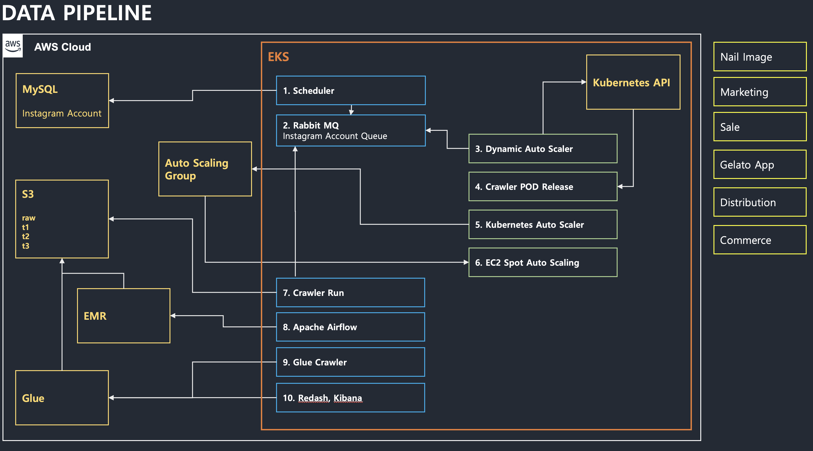
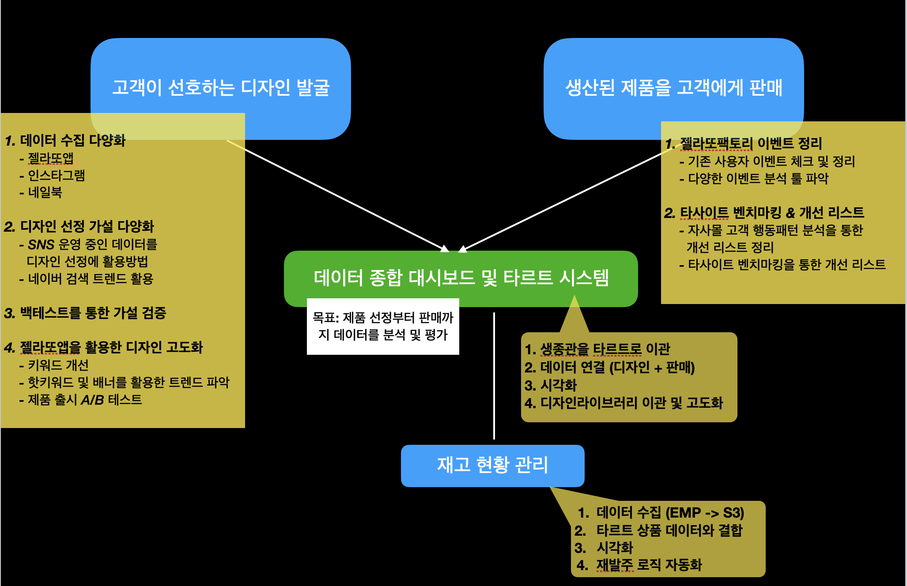

# 젤라또랩
  **데이터 커머스 회사** :\
    유저들이 온라인에서 컨텐츠와 재화를 소비하는 과정에서 남긴 흔적(데이터)을 갖고\
    유저들의 재화에 대한 가변적인 선호도를 이해하고 이를 갖고 재화를 기획하여, 유통하는 커머스 회사

### 데이터 기반 상품 기획
-----
1. 매일 2,000장의 네일 디자인의 크롤링/업로드를 통해 DB화
2. 유저 탐색과정에서 발생하는 유저 행동지표데이터 수집
3. 내부 알고리즘에 따른 디자인 선별 및 스코어링
4. 스코어링 기준으로 금주의 TOP 200디자인 선정
5. 기간 내 "검색 최상위 트렌드", "상승 키워드 10% 이상 점유율"를 통한 키워드 추출
6. 선정된 디자인내에서 5번의 키워드 조건 모두 충족하는 디자인만 최종 선별
7. 디자인 시안을 기존에 출시된 컬렉션별로 그룹핑하여 컬렉션별 N 종의 상품화 디자인 결정

  
#### 디자인 선정

#### DATA PIPELINE

#### 데이터 기반 업무 프로세스 구축 과정

